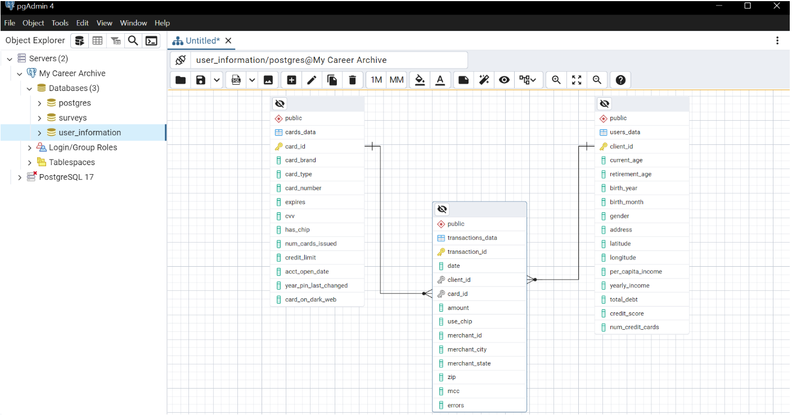
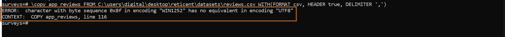

# Database Creation and Data Ingestion from Large CSV Files (Reticent - finance/fintech)


## Project Motivation & Overview
To apply my conceptual knowledge in Data Engineering about databases, i decided to work on this project where i developed two databases from scratch. In one database i implemented a star schema design as i noticed a one-to-many table relationships from the dimensional tables (users_data and cards_data) to the fact table (transactions_data). The second database structure is flat, as there was no table connections to model. My objective was to create a foundational OLAP and OLTP data storage structure for a finance or fintech company - Reticent, using datasets from kaggle.com 

### Technologies/Frameworks Used: 
* SQL
* Postgres RDMS (PgAdmin)
* Draw.io (to map out data architecture diagrams)
* Star schema database structure
* Flat schema database structure
  
### Role in Project
Data engineer - designing the databases and implementing project requirements (Reported to the head of data team)


## Problem Statement
Reticent, a finance startup in its early phase, has successfully completed its product validation period. During this phase, 1,500+ users signed up and transacted with the product. The company collected and stored data from its mobile app and web platform, including user transactions, card information, merchant category codes (MCC), and customer surveys and app reviews. 

These data were stored on a local file server that became inefficient due to performance issues and scalability challenges. As the volume of transactions increased, the company began to face difficulties in managing and retrieving data from the server.

The engineering team aims to ensure its product is scalable and can handle increasing transaction volumes while maintaining high performance. To achieve this, the head of the data team has emphasized the need for a clear separation of data storage for different data flows.

### Challenges:
Reticent’s operations involve managing two distinct categories of data:
* Transactional Data (OLTP): This includes sensitive user information, transaction records, card details, and merchant category codes (MCC). This data requires real-time processing with minimal latency to support daily operations.
  
* Non-Transactional Data (OLAP): This includes customer feedback, surveys, and app reviews. Unlike transactional data, it is updated less frequently and will be primarily used for product evaluation and analysis.

Currently, Reticent has already accumulated a significant amount of data from the local server now downloaded and stored as CSV files. As part of this project, the data engineer (Raphael) will ingest this existing CSV data into the appropriate database tables.

### Project Goals:
* Transactional Data Storage: A high-performance OLTP system optimized to ensure smooth day-to-day operations.
* Non-Transactional Data Storage: A separate database for read heavy operations, to support querying, reporting, and analytics

### Objectives:
1. Scalability & Performance: Ensure the database design can handle future growth in both transactional and non-transactional data volumes.
2. Separation of Concerns: Isolate transactional and non-transactional data to enhance system performance and manageability.
3. Optimization for Reporting: Design a flat database for efficient data retrieval for analytical and product evaluation purposes.
4. Data Ingestion: Correctly and completely ingesting all stored data in CSV files into the respective database tables.

This foundational data architecture will not only support current operations but also lay the groundwork for future expansions as Reticent continues to grow.


# About the Dataset
The datasets consists of 5 csv files:
* Cards Data - 6,147 records
* Users Data - 2,000 records
* Transactions Data - 13,305,915 records
* Investments Data - 40 records
* App Reviews - 789,548 records
Sources: kaggle.com


# Database Table Development
Started first by mapping out the table structures for the databases using [draw.io](https://draw.io). Then developed the sql quries for the two dabases to store transactional and non transaction data:

<div align="center">
<table>
  <tr>
    <td align="center">
      <div>
        <div>*Diagram: user_information</div>
        <a href="https://github.com/Levinders/Database-Creation-and-Data-Ingestion-from-Large-CSV-Files-Reticent---finance-fintech-/raw/main/images/star_shema_diagram.png" target="https://github.com/Levinders/Database-Creation-and-Data-Ingestion-from-Large-CSV-Files-Reticent---finance-fintech-/raw/main/images/star_shema_diagram.png">
          
        </a>
      </div>
    </td>
    <td align="center">
      <div>
        <div>*Diagram: surveys</div>
        <a href="https://github.com/Levinders/Database-Creation-and-Data-Ingestion-from-Large-CSV-Files-Reticent---finance-fintech-/raw/main/images/flat_schema_diagram.png" target="[_blank](https://github.com/Levinders/Database-Creation-and-Data-Ingestion-from-Large-CSV-Files-Reticent---finance-fintech-/raw/main/images/flat_schema_diagram.png">
          
        </a>
      </div>
    </td>
  </tr>
</table>
</div>

### First Database: user_information

<div align="center">
<table>
  <tr>
    <td align="center">
      <div>
        <div>* Table: cards_data (zero data)</div>
        <a href="https://github.com/Levinders/Database-Creation-and-Data-Ingestion-from-Large-CSV-Files-Reticent---finance-fintech-/raw/main/images/table_creation(cards_data).png" target="https://github.com/Levinders/Database-Creation-and-Data-Ingestion-from-Large-CSV-Files-Reticent---finance-fintech-/raw/main/images/table_creation(cards_data).png">
          
        </a>
      </div>
    </td>
    <td align="center">
      <div>
        <div>* Table: users_data (zero data)</div>
        <a href="https://github.com/Levinders/Database-Creation-and-Data-Ingestion-from-Large-CSV-Files-Reticent---finance-fintech-/raw/main/images/table_creation(users_data).png" target="[_blank](https://github.com/Levinders/Database-Creation-and-Data-Ingestion-from-Large-CSV-Files-Reticent---finance-fintech-/raw/main/images/table_creation(users_data).png)">
          
        </a>
      </div>
    </td>
  </tr>
</table>
</div>

<div align="center">
<table>
  <tr>
    <td align="center">
      <div>
        <div>* Table: transactions_data (zero data)</div>
        <a href="https://github.com/Levinders/Database-Creation-and-Data-Ingestion-from-Large-CSV-Files-Reticent---finance-fintech-/raw/main/images/table_creation(transactions_data).png" target="https://github.com/Levinders/Database-Creation-and-Data-Ingestion-from-Large-CSV-Files-Reticent---finance-fintech-/raw/main/images/table_creation(transactions_data).png">
          
        </a>
      </div>
    </td>
    <td align="center">
      <div>
        <div>.</div>
        <a href="https://github.com/Levinders/Database-Creation-and-Data-Ingestion-from-Large-CSV-Files-Reticent---finance-fintech-/raw/main/images/blank.png" target="[_blank](https://github.com/Levinders/Database-Creation-and-Data-Ingestion-from-Large-CSV-Files-Reticent---finance-fintech-/raw/main/images/blank.png)">
          
        </a>
      </div>
    </td>
  </tr>
</table>
</div>

### Second Database: surveys

<div align="center">
<table>
  <tr>
    <td align="center">
      <div>
        <div>* Table: investments (zero data)</div>
        <a href="https://github.com/Levinders/Database-Creation-and-Data-Ingestion-from-Large-CSV-Files-Reticent---finance-fintech-/raw/main/images/table_creation(investments).png" target="https://github.com/Levinders/Database-Creation-and-Data-Ingestion-from-Large-CSV-Files-Reticent---finance-fintech-/raw/main/images/table_creation(investments).png">
          
        </a>
      </div>
    </td>
    <td align="center">
      <div>
        <div>* Table: app_review (zero data)</div>
        <a href="https://github.com/Levinders/Database-Creation-and-Data-Ingestion-from-Large-CSV-Files-Reticent---finance-fintech-/raw/main/images/table_creation(app_reviews).png" target="[_blank](https://github.com/Levinders/Database-Creation-and-Data-Ingestion-from-Large-CSV-Files-Reticent---finance-fintech-/raw/main/images/table_creation(app_reviews).png)">
          
        </a>
      </div>
    </td>
  </tr>
</table>
</div>

# Data Ingestion into The Databases
Considering the thousands and millions of rows in the csv files, manually inserting values into the tables is inefficient. Used the command line to connect to the database and bulk ingest data into the appropriate tables. The red lines are command output, while, green and yellow are sequence of commands used - interchanging databases 'user_information' to 'surveys'

<div align="center">
<table>
  <tr>
    <td align="center">
      <div>
        <div>* Commandline database connection (zero data)</div>
        <a href="https://github.com/Levinders/Database-Creation-and-Data-Ingestion-from-Large-CSV-Files-Reticent---finance-fintech-/raw/main/images/db_commandline.png" target="https://github.com/Levinders/Database-Creation-and-Data-Ingestion-from-Large-CSV-Files-Reticent---finance-fintech-/raw/main/images/db_commandline.png">
          
        </a>
      </div>
    </td>
    <td align="center">
      <div>
        <div>* Bulk ingesting data from csv files</div>
        <a href="https://github.com/Levinders/Database-Creation-and-Data-Ingestion-from-Large-CSV-Files-Reticent---finance-fintech-/raw/main/images/commandline_ingestion.png" target="[_blank](https://github.com/Levinders/Database-Creation-and-Data-Ingestion-from-Large-CSV-Files-Reticent---finance-fintech-/raw/main/images/commandline_ingestion.png">
          
        </a>
      </div>
    </td>
  </tr>
</table>
</div>

Populated tables - all 7 tables successfully updated with records. Here 2 sample tables:

<div align="center">
<table>
  <tr>
    <td align="center">
      <div>
        <div>* Database connection (CMD)</div>
        <a href="https://github.com/Levinders/Database-Creation-and-Data-Ingestion-from-Large-CSV-Files-Reticent---finance-fintech-/raw/main/images/populated_users_data.png" target="https://github.com/Levinders/Database-Creation-and-Data-Ingestion-from-Large-CSV-Files-Reticent---finance-fintech-/raw/main/images/populated_users_data.png">
          
        </a>
      </div>
    </td>
    <td align="center">
      <div>
        <div>* Ingesting from csv to tables</div>
        <a href="https://github.com/Levinders/Database-Creation-and-Data-Ingestion-from-Large-CSV-Files-Reticent---finance-fintech-/raw/main/images/populated_transactions_data.png" target="[_blank](https://github.com/Levinders/Database-Creation-and-Data-Ingestion-from-Large-CSV-Files-Reticent---finance-fintech-/raw/main/images/populated_transactions_data.png">
          
        </a>
      </div>
    </td>
  </tr>
</table>
</div>

# Modeling Table Relationships
* survey database has a flat schema since there's no table connections. Developed the queries below to model the relationships in the user_information database:

```sql

-- Drop this column in order to implement star schema design
ALTER TABLE cards_data 
    DROP COLUMN client_id;


-- Modeling table relationships
ALTER TABLE users_data
    ADD CONSTRAINT users_data_pkey PRIMARY KEY (client_id);

ALTER TABLE cards_data
    ADD CONSTRAINT cards_data_pkey PRIMARY KEY (card_id);

ALTER TABLE transactions_data
    ADD CONSTRAINT transactions_data_pkey PRIMARY KEY (transaction_id),
        ADD CONSTRAINT users_data_fkey FOREIGN KEY (client_id)
        REFERENCES users_data(client_id)
        ON DELETE SET NULL,
    ADD CONSTRAINT cards_data_fkey FOREIGN KEY (card_id)
        REFERENCES cards_data(card_id)
        ON DELETE SET NULL 
    ;
```

* ERD Diagram in PgAdmin (one-to-many)


# Conclusion
This project demonstrates the foundational steps involved in designing scalable database systems tailored to the specific needs of a growing fintech company. By implementing both a star schema (for transactional data) and a flat schema (for non-transactional data), I ensured an efficient separation of concerns, optimizing performance and maintainability.

Using PostgreSQL, I successfully ingested large CSV datasets — including over 13 million transaction records — into the appropriate database tables. The architecture not only supports current operational needs but is also flexible enough to handle future growth in data volume.

Overall, this project strengthened my practical understanding of data modeling, database management, and large-scale data ingestion — key components in the data engineering lifecycle.

# Challenges & Solutions
* When i attempted to ingest the reviews csv file, i kept getting an error because Postgres doesn't support non UTF-8 encoded characters. So, i open the file in vscode, used '[^\x00-\x7F]+' to find and replace non UTF-8 characters in the reviews text column.



<div align="center">
<table>
  <tr>
    <td align="center">
      <div>
        <div>* non UTF-8 characters</div>
        <a href="https://github.com/Levinders/Database-Creation-and-Data-Ingestion-from-Large-CSV-Files-Reticent---finance-fintech-/raw/main/images/UTF-8.png" target="https://github.com/Levinders/Database-Creation-and-Data-Ingestion-from-Large-CSV-Files-Reticent---finance-fintech-/raw/main/images/UTF-8.png">
          
        </a>
      </div>
    </td>
    <td align="center">
      <div>
        <div>* Postgres supported (UTF-8)</div>
        <a href="https://github.com/Levinders/Database-Creation-and-Data-Ingestion-from-Large-CSV-Files-Reticent---finance-fintech-/raw/main/images/encoded_reviews.png" target="[_blank](https://github.com/Levinders/Database-Creation-and-Data-Ingestion-from-Large-CSV-Files-Reticent---finance-fintech-/raw/main/images/encoded_reviews.png">
          
        </a>
      </div>
    </td>
  </tr>
</table>
</div>

### Author
Raphael Levinder
[Linkedin](https://linkedin.com/in/raphaellevinder)


