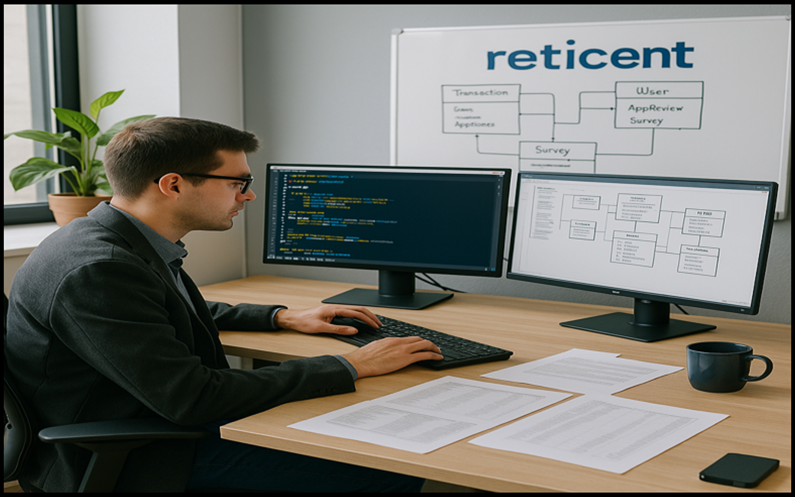

# Database Creation and Data Ingestion from Large CSV Files (Reticent - finance/fintech)

## Project Motivation & Overview
To apply my conceptual knowledge in Data Engineering about databases, i decided to work on this project where i developed two databases from scratch. In one database i implemented a star schema design as i noticed a one-to-many table relationships from the dimensional tables (users_data and cards_data) to the fact table (transactions_data). The second database structure is flat, as there was no table connections to model. My objective was to create a foundational OLAP and OLTP data storage structure for a finance or fintech company - Reticent, using datasets from kaggle.com 

### Technologies/Frameworks Used: 
* SQL
* Postgres RDMS (PgAdmin)
* Draw.io (to map out data architecture diagrams)
* Star schema database structure
* Flat schema database structure
  
### Role in Project
Data engineer - designing the databases and implementing project requirements (Reported to the head of data team)

## Problem Statement
Reticent, a finance startup in its early phase, has successfully completed its product validation period. During this phase, 1,500+ users signed up and transacted with the product. The company collected and stored data from its mobile app and web platform, including user transactions, card information, merchant category codes (MCC), and customer surveys and app reviews. 

These data were stored on a local file server that became inefficient due to performance issues and scalability challenges. As the volume of transactions increased, the company began to face difficulties in managing and retrieving data from the server.

The engineering team aims to ensure its product is scalable and can handle increasing transaction volumes while maintaining high performance. To achieve this, the head of the data team has emphasized the need for a clear separation of data storage for different data flows.

### Challenges:
Reticent’s operations involve managing two distinct categories of data:
* Transactional Data (OLTP): This includes sensitive user information, transaction records, card details, and merchant category codes (MCC). This data requires real-time processing with minimal latency to support daily operations.
  
* Non-Transactional Data (OLAP): This includes customer feedback, surveys, and app reviews. Unlike transactional data, it is updated less frequently and will be primarily used for product evaluation and analysis.

Currently, Reticent has already accumulated a significant amount of data from the local server now downloaded and stored as CSV files. As part of this project, the data engineer (Raphael) will ingest this existing CSV data into the appropriate database tables.

### Project Goals:
* Transactional Data Storage: A high-performance OLTP system optimized to ensure smooth day-to-day operations.
* Non-Transactional Data Storage: A separate database for read heavy operations, to support querying, reporting, and analytics

### Objectives:
1. Scalability & Performance: Ensure the database design can handle future growth in both transactional and non-transactional data volumes.
2. Separation of Concerns: Isolate transactional and non-transactional data to enhance system performance and manageability.
3. Optimization for Reporting: Design a flat database for efficient data retrieval for analytical and product evaluation purposes.
4. Data Ingestion: Correctly and completely ingesting all stored data in CSV files into the respective database tables.

This foundational data architecture will not only support current operations but also lay the groundwork for future expansions as Reticent continues to grow.

# About the Dataset
The datasets consists of 5 csv files:
* Cards Data - 6,147 records
* Users Data - 2,000 records
* Transactions Data - 13,305,915 records
* Investments Data - 40 records
* App Reviews - 789,548 records
Sources: kaggle.com

# Database Table Development
I develop two different dabases to store transactional and non transaction data

### First Database: user_information
* Table: users_data (zero data)
.png)

* Table: cards_data (zero data)
.png)

* Table: transactions_data (zero data)
.png)

### Second Database: surveys
* Table: investment (zero data)
.png)

* Table: app_reviews (zero data)
.png)

<table>
  <tr>
    <td style="margin: 10px; padding: 10px; text-align: left;">
      <figure style="margin: 0;">
        
      </figure>
    </td>
    <td style="margin: 10px; padding: 10px; text-align: left;">
      <figure style="margin: 0;">
        <figcaption>4. Investments Data - 40 records</figcaption>
        
      </figure>
    </td>
  </tr>
</table>

<table>
  <tr>
    <td style="margin: 10px; padding: 10px; text-align: left;">
      <figure style="margin: 0;">
        <figcaption>5. App Reviews - 789,548 records</figcaption>
        
      </figure>
    </td>
        <td style="margin: 10px; padding: 10px; text-align: left;">
      <figure style="margin: 0;">
       </a>
      </figure>
    </td>
  </tr>
</table>

Architecture: Describe the high-level architecture of the pipeline or system (e.g., ingesting, processing, storing data in real-time or batch).
Process: Outline the pipeline stages (data ingestion, transformation, loading, etc.) and technologies used (e.g., ETL tools, streaming platforms).
Automation: Explain the automation aspects of the pipeline (e.g., scheduled data jobs, real-time data streaming, or event-driven data flow).

5. Data Processing & Transformation
Methods: Discuss the data processing techniques applied (e.g., batch vs. real-time, use of SQL, Spark, or Python scripts for transformation).
Implementation: Provide a brief explanation of how you transformed raw data into usable formats or structures (e.g., cleaning, filtering, aggregating).

6. Scalability & Optimization
Scalability: Explain how you designed the system for scalability (e.g., partitioning data, parallel processing, distributed systems).
Optimization: Mention any optimization techniques (e.g., indexing, caching, or performance tuning) used to improve efficiency.

7. Testing & Validation
Testing: Describe any testing processes implemented to ensure data integrity (e.g., unit tests, pipeline health checks, and validation).
Data Validation: Explain how data was validated at each stage of the pipeline to ensure consistency and accuracy.

8. Results
Outcome: Present the key results of the project (e.g., improved data processing speed, automation of previously manual tasks).
Evaluation: Define the success criteria (e.g., reduced processing time, improved data availability) and how you evaluated the project’s performance.

9. Conclusion
Summary: Recap the key outcome of the project, emphasizing the success in solving the technical problem.
Next Steps: Suggest potential improvements or future iterations (e.g., scaling to larger datasets, integrating new data sources).

10. Challenges & Solutions
Obstacles: State any difficulties encountered during the project (e.g., bottlenecks in data processing, integration issues).
Solutions: Mention how you overcame them (e.g., redesigning the pipeline for better scalability, using new technologies).

11. Code & Visuals
Code: Provide key code snippets (e.g., sample pipeline script, SQL queries, or configuration files) with explanations of their functionality.
Visuals: Include any relevant diagrams or flowcharts that illustrate the architecture or data flow in the system.

12. References
Citations: Mention any external resources, libraries, tools, or research papers you referred to while building the project (e.g., official documentation, GitHub repos, tutorials).

